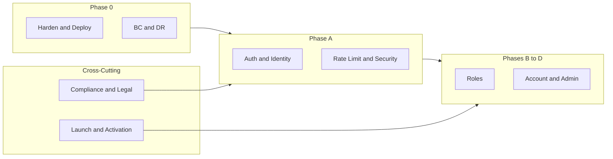

# Go-to-Market (GTM) Plan: Full Product Build

**Document version:** 1.1  
**Created:** 2026-02-07  

**Changelog:**  
- **1.1:** Added Compliance and Legal (RUFADAA, GDPR, retention, user rights); production auth (JWT/JWKS, rate limiting, brute-force); BCDR for Phase 0; Launch and Activation (metrics, support); expanded risk register and incident response; diagram and appendix updates.

**Scope:** Transform the current MVP (multi-chain estate planning: BTC, XMR, STX) into a fully developed, production-ready GTM product with authentication, roles, admin, account management, and optional wallet features.

This plan draws on: this conversation (MVP complete, multi-network, product roadmap); [DEVELOPER_CHECKLISTS_UNIVERSAL](../../Estate_Management/docs/checklists/DEVELOPER_CHECKLISTS_UNIVERSAL.md); [CHECKLISTS_INDEX](checklists/CHECKLISTS_INDEX.md); [GITHUB_SEARCH_RESULTS_AND_ANALYSIS](GITHUB_SEARCH_RESULTS_AND_ANALYSIS.md); [PRODUCT_ROADMAP](PRODUCT_ROADMAP.md); [VERSION_STATE_AND_NEXT_STEPS](VERSION_STATE_AND_NEXT_STEPS.md); [DEPLOY](DEPLOY.md); Checklists.txt (industry checklists); and common industry standards (OWASP, WCAG, RFC 7807, TLS, etc.).

---

# Part 1: Branding

## 1.1 Name

**Primary recommendation: Legacy Vault**

- **Legacy** = inheritance, what you leave behind, next of kin.
- **Vault** = secure storage, protection, multi-chain “vault” of addresses and plans.
- Memorable, professional, and not overly “crypto” while still fitting BTC/XMR/STX estate planning.

**Alternatives (for consideration):**

| Name           | Rationale |
|----------------|-----------|
| **Keyhold**    | Keys + hold; implies holding keys for beneficiaries. Short, distinctive. |
| **Vault Forward** | Forwarding assets to the future; slightly longer. |
| **Inheritance Ledger** | Ledger = record-keeping + crypto connotation; more formal. |
| **Next of Kin** | Direct, human; less “tech” but very clear. |

**Decision:** Adopt **Legacy Vault** unless stakeholders prefer an alternative. Use consistently in: app title, metadata, README, frontend layout, and any public-facing copy.

---

## 1.2 Slogan / Tagline

**Primary:**  
**“Secure your crypto for those who come next.”**

**Alternatives:**

- “Multi-chain estate planning. Your keys, their future.”
- “Plan once. Protect BTC, XMR, and STX for the people you care about.”
- “Estate planning for Bitcoin, Monero, and Stacks.”

Use the primary slogan in: meta description, landing/marketing copy, footer, and optional “About” or help section.

---

## 1.3 Logo Concept

**Direction:** Trust, clarity, multi-chain, inheritance.

- **Symbol:** A stylized **vault door** or **key** combined with a **chain link** or **three small nodes** (suggesting BTC, XMR, STX) or a simple **family-tree / inheritance** motif (e.g. one node branching to several).
- **Style:** Clean, minimal, works at small sizes (favicon 16×16–32×32). Prefer single-color or two-color (e.g. primary + accent) for flexibility on light/dark backgrounds.
- **Deliverables:**  
  - Primary logo (full: symbol + wordmark “Legacy Vault”).  
  - Symbol-only for favicon and app icon.  
  - Favicon set (e.g. 16×16, 32×32, 180×180 for Apple Touch).  
  - Optional: dark-mode variant.

**Placement:** Browser tab (favicon), app header, login screen, marketing pages, README, and any future app-store or distribution assets.

---

## 1.4 Theme and Visual Identity

**Mood:** Trustworthy, calm, professional, inclusive. Avoid “casino” or aggressive crypto aesthetics.

**Color palette (recommended):**

| Role      | Hex       | Usage |
|-----------|-----------|--------|
| Primary   | `#0f172a` (slate-900) | Headers, primary text, nav |
| Secondary | `#334155` (slate-700) | Body text, secondary UI |
| Accent    | `#0ea5e9` (sky-500)   | Links, primary buttons, focus rings |
| Accent-alt| `#f59e0b` (amber-500) | Highlights, “legacy”/value accent, optional CTAs |
| Surface   | `#f8fafc` (slate-50)  | Page background |
| Card      | `#ffffff`            | Cards, modals |
| Success   | `#10b981` (emerald-500) | Success toasts, active states |
| Error     | `#ef4444` (red-500)  | Errors, destructive actions |
| Border    | `#e2e8f0` (slate-200) | Borders, dividers |

**Accessibility:** Ensure contrast meets WCAG AA (e.g. primary text on surface ≥ 4.5:1). Use [WebAIM Contrast Checker](https://webaim.org/resources/contrastchecker/) for key combinations.

**Typography:**

- **Headings:** Sans-serif, clear hierarchy (e.g. Inter, DM Sans, or system font stack: `ui-sans-serif, system-ui, sans-serif`).
- **Body:** Same family; 16px base; line height 1.5–1.6 for readability.
- **Monospace:** For addresses (BTC, XMR, STX): `ui-monospace, monospace`; preserve copy-paste and truncation for long strings.

**Spacing and layout:**

- Consistent spacing scale (e.g. 4, 8, 12, 16, 24, 32, 48 px).
- Max content width for readability (e.g. 1024–1280 px); generous padding on mobile.

**Components:**

- Buttons: clear primary vs secondary vs ghost; focus visible (ring).
- Forms: labeled inputs, error states, optional helper text.
- Cards: subtle border or shadow; hover state where appropriate.

---

## 1.5 Additional Branding Assets

- **Favicon and app icons:** Generated from logo symbol; include 16×16, 32×32, 180×180 (Apple Touch), 192×192, 512×512 if building PWA. Use [Real Favicon Generator](https://realfavicongenerator.net/) or equivalent.
- **Meta and Open Graph:**  
  - `title`: “Legacy Vault – Multi-Chain Estate Planning” (or chosen name).  
  - `description`: Slogan + one line (e.g. “Plan beneficiaries and timelock policies for Bitcoin, Monero, and Stacks.”).  
  - `og:image`: Logo or branded social card (1200×630 recommended).
- **Legal and trust:** Placeholder pages or sections for Terms of Service, Privacy Policy, and (if applicable) “How we handle your data” — required for GTM and compliance.
- **Voice and tone:** Professional, reassuring, clear. Avoid jargon where possible; explain “timelock,” “beneficiary,” “allocation” in tooltips or help if needed.

---

# Part 1.5: Compliance and Legal

## 1.5.1 Digital estate and inheritance (RUFADAA)

- **Disclaimer:** Legacy Vault is a planning and documentation tool only; it does not provide legal or fiduciary advice. Users should use it to document plans and inform beneficiaries; actual transfer of assets and legal authority must be handled through traditional legal mechanisms (wills, trusts, executor appointment) and applicable law (e.g. RUFADAA where adopted).
- **In-app:** Require or recommend a short disclaimer on first use or in Terms of Service; optional "Learn more" link to a static page explaining digital estate planning and the role of legal professionals.
- **Checklist:** Legal disclaimer and ToS/Privacy placeholders (already in branding) explicitly reference "digital estate planning tool, not legal advice."

## 1.5.2 GDPR and data protection

- **Data retention:** Define retention per category; justify each with purpose (contract, legal obligation, legitimate interest). Document in a retention matrix:

| Data category    | Retention | Purpose / basis |
|------------------|-----------|------------------|
| Account data     | While account active + 30 days after deletion request | Contract; then erasure |
| Audit logs       | 12 months (or as required by security/compliance)      | Legitimate interest / legal |
| Sessions         | Until expiry or logout                                 | Contract performance |

- **Privacy policy requirements:** Controller identity and contact; processing purposes and legal bases; retention periods; data subject rights (access, rectification, erasure, portability, restriction, objection); right to complain to supervisory authority; international transfers if any.
- **User rights implementation (GTM checklist):** (1) **Account deletion:** Delete or anonymize user and associated data; cascade or document handling of estate_plans/beneficiaries. (2) **Data export:** Export my plans/beneficiaries as JSON. (3) **Access:** User can view their profile and linked data via existing `/me` and plan endpoints.
- **Cookie and tracking:** If analytics or non-essential cookies are added, document consent (granular opt-in, logged with timestamp) and list in privacy policy; avoid pre-ticked boxes.
- **Reference:** [GDPR checklist](https://gdpr.eu/checklist/) (see Appendix A).

## 1.5.3 Fintech / crypto regulatory awareness (light-touch)

- **Out of scope for initial GTM:** No custody, no exchange, no payment processing—so MiCA/VASP/FCA registration may not apply. If the product later holds or moves user funds, or operates in regulated jurisdictions (EU MiCA, UK FCA), a regulatory mapping and compliance program (policies, MLRO, AML/KYC if required) will be needed; for current GTM, document that the app does not trigger these and revisit if scope changes.
- **Customer support:** Establish customer support channel (e.g. email or support form) and document response expectations; see Part 8 (Launch and Activation) for post-launch support.

---

# Part 2: GTM Scope and Success Criteria

## 2.1 In scope for GTM

- **Phase 0:** Harden & deploy MVP (server, TLS, env, checklists).
- **Phase A:** Authentication and identity (login, sessions or JWT, “current user” in API and UI).
- **Phase B:** User types and roles (owner, beneficiary, executor, admin); permission checks; role-based menus.
- **Phase C:** User configuration and account (profile, preferences, account details; optional 2FA).
- **Phase D:** Admin area (user management, moderation, system config, audit views).
- **Phase E (optional):** Wallet-related features (read-only or connection, address derivation, balance display; timelock execution only if specified).
- **Branding:** Name, slogan, logo, theme, favicon, meta (as in Part 1).
- **Quality and compliance:** Design, plan, build, test, and deploy checklists satisfied; security and accessibility addressed.

## 2.2 Out of scope (unless explicitly added later)

- Custody of keys or funds; on-chain transaction signing (unless Phase E specifies it).
- Native mobile apps (web-first; responsive is in scope).
- Full Monero view-key or wallet-file recovery flows (documented as future in [MULTI_NETWORK_EXPLORATION](MULTI_NETWORK_EXPLORATION.md)).
- Stacks Clarity smart contracts (concept-only unless Phase E specifies).
- Multi-tenancy or white-label; single product instance.

## 2.3 Success criteria

- **Functional:** A designated user can register/login, create and manage estate plans (BTC/XMR/STX addresses), add beneficiaries and timelock policies, and (with roles) access only what they’re allowed; admins can manage users and view audit data.
- **Non-functional:** API response times within target (e.g. p95 &lt; 500 ms for key endpoints); availability target (e.g. 99% uptime or as agreed); no critical or high security findings from checklist and hardening.
- **Compliance:** Auth and sensitive data handling per design; logging without secrets/PII; TLS in production; checklist sign-off before launch.
- **Branding:** App consistently presents as “Legacy Vault” (or chosen name) with slogan, theme, and favicon in place.

---

# Part 3: Phase Breakdown

## Phase 0: Harden & Deploy (Pre–GTM)

**Goal:** Run the current MVP on a real server with TLS, proper config, and checklist alignment so GTM phases build on a stable base.

### 3.0.1 Design checklist (Phase 0)

- [ ] **Requirements:** Document that Phase 0 scope = server deploy + TLS + env + checklist pass; no new features.
- [ ] **Architecture:** Confirm diagram or description: API (Rust/Axum), frontend (Next.js), Postgres; Docker/VM; single region.
- [ ] **Security – design:** Confirm TLS only in production; no secrets in repo; env-based config; CORS and allowed hosts documented.
- [ ] **Observability:** Health (`/health`) and version (`/version`) already exist; confirm logging (request ID, audit events) and that no secrets/PII are logged.

### 3.0.2 Plan checklist (Phase 0)

- [ ] **Work breakdown:** Tasks: (1) Server access and env setup, (2) Postgres/create DB, (3) Build and run API (e.g. Docker or binary), (4) Build and serve frontend (e.g. static export + nginx or Node), (5) TLS (e.g. Let’s Encrypt + nginx), (6) Run checklists (security, production, SPA).
- [ ] **Risks:** Server unavailable, DNS/TLS delay; mitigation: document runbook, use staging first.
- [ ] **Tracking:** All tasks in backlog/board with “Phase 0” tag or epic.

### 3.0.3 Build checklist (Phase 0)

- [ ] **Config:** All config via env (DATABASE_URL, API_HOST/PORT, NEXT_PUBLIC_API_URL); no hardcoded secrets.
- [ ] **Dockerfile:** Present and tested; migrations run on startup; health check in image if applicable.
- [ ] **Frontend build:** `npm run build` (and export if static); production API URL from env.
- [ ] **Branch protection:** Default branch protected; PR + CI required (already in place).

### 3.0.4 Test checklist (Phase 0)

- [ ] **CI:** `cargo fmt`, `cargo clippy`, `cargo test` (with Postgres) pass on every PR.
- [ ] **Smoke:** After deploy, `GET /health` and `GET /version` return expected; frontend loads and can list estate plans.
- [ ] **No regression:** Existing 6 integration tests still pass.

### 3.0.5 Deploy checklist (Phase 0)

- [ ] **Version/tag:** Release tagged (e.g. `v0.2.0-phase0`); release notes mention “Phase 0: server deploy + TLS.”
- [ ] **Pre-deploy:** Staging smoke test; rollback plan (revert to previous image or binary + DB backup if needed).
- [ ] **Secrets:** Production secrets in secure store or server env; not in repo.
- [ ] **TLS:** HTTPS only; HSTS and redirect HTTP→HTTPS (e.g. nginx).
- [ ] **Post-deploy:** Smoke test production; confirm health and frontend; document in [DEPLOY](DEPLOY.md) and Server_Management_Lunaverse if used.
- [ ] **Checklists:** Run [going_to_production_serverside](checklists/CHECKLISTS_INDEX.md), [going_to_production_spa](checklists/CHECKLISTS_INDEX.md), [docker_secure_deployment](checklists/CHECKLISTS_INDEX.md) as applicable; fix gaps.

### 3.0.6 Definition of done (Phase 0)

- API and frontend run on target server; TLS in front; env-based config; CI green; checklists run and gaps documented or fixed; [VERSION_STATE_AND_NEXT_STEPS](VERSION_STATE_AND_NEXT_STEPS.md) updated.

### 3.0.7 Business continuity and disaster recovery (BCDR)

- [ ] **RTO/RPO:** Define Recovery Time Objective (e.g. target max downtime in hours) and Recovery Point Objective (e.g. max acceptable data loss—e.g. 24 hours) for the application and database; document in the plan.
- [ ] **Backups:** Automated DB backups (daily or per deployment); backup retention (e.g. 7–30 days); test restore at least once per release or quarterly.
- [ ] **Runbook:** Document steps to restore from backup; redeploy previous version; who to contact (owner, host). Link or mention in [DEPLOY](DEPLOY.md).
- [ ] **Testing:** BC/DR plan documented; backup restore tested; runbook updated and accessible.
- [ ] **Governance:** Assign an owner for BCDR updates (e.g. same as deploy owner); review plan when architecture or data criticality changes.

---

## Phase A: Authentication & Identity

**Goal:** Users can register and log in; API and frontend know “current user”; all plan/beneficiary operations are scoped to that user.

### 3.A.1 Design

- [ ] **Auth mechanism:** Choose and document: **session-based** (cookie + server-side session store, e.g. Postgres or Redis) **or JWT** (access + optional refresh). Recommendation: sessions for simpler revocation and cookie security (HttpOnly, Secure, SameSite); JWT if you need stateless or multi-service later. **If JWT is chosen later** (e.g. for mobile or multi-service), apply production JWT requirements: asymmetric signing (RS256/ES256) or validated JWKS endpoint; never trust `alg` from token alone—validate against a whitelist; validate `iss`, `aud`, `exp`, `nbf` with configurable leeway for clock drift; for multi-instance use a shared cache (e.g. Redis) for JWKS/key cache to avoid thundering herd. Reference: [Production JWT in Axum](https://pipinghot.dev/production-ready-jwt-validation-in-axum-a-real-implementation/), crates `axum-jwks` / `axum-jwt-auth`.
- [ ] **Registration:** Email + password (or OAuth later); password rules (length, complexity); email verification optional but recommended for GTM.
- [ ] **Login / logout:** Login endpoint returns session cookie or JWT; logout invalidates session or token.
- [ ] **“Current user”:** Every protected API route resolves user from session/JWT; `user_id` in `estate_plans` (and any user-scoped tables) set and checked.
- [ ] **Sensitive data:** Passwords hashed (e.g. Argon2 or bcrypt); never log passwords or tokens; PII in logs only if necessary and redacted.
- [ ] **API surface:** Document endpoints: `POST /auth/register`, `POST /auth/login`, `POST /auth/logout`, `GET /api/v1/me` (current user profile); list/create/update/delete estate plans and beneficiaries require authenticated user and scope by `user_id`.

### 3.A.2 Schema (migrations)

- [ ] **users:** `id`, `email` (unique), `password_hash`, `name` (optional), `email_verified_at` (optional), `created_at`, `updated_at`.
- [ ] **sessions:** `id` (UUID), `user_id`, `token_hash` or `session_data`, `expires_at`, `created_at` (if session-based).
- [ ] **estate_plans:** Already has `user_id`; add FK to `users(id)`; backfill existing rows to a default “system” user or migrate data as needed.
- [ ] Indexes: `users(email)`, `sessions(user_id)`, `sessions(expires_at)`.
- [ ] **Email verification flow:** Send verification link or code on register (and on email change); optional: restrict sensitive actions until verified (or show banner).

### 3.A.3 Backend (Rust)

- [ ] **Password hashing:** Use `argon2` or `bcrypt` crate; hash on register and on password change; verify on login.
- [ ] **Session or JWT:** Implement middleware that extracts user from cookie (session) or `Authorization: Bearer <token>` (JWT) and attaches to request; return 401 when missing or invalid.
- [ ] **Routes:** Register, login, logout, `GET /api/v1/me`; protect all `/api/v1/*` except health/version with auth middleware.
- [ ] **Scoping:** Create/update estate plan sets `user_id` from current user; list/get filter by `user_id`; same for beneficiaries via estate_plan ownership.
- [ ] **Validation:** Email format; password strength.
- [ ] **Rate limiting (required for GTM):** Apply per-IP rate limits to `POST /auth/login` and `POST /auth/register` (e.g. 5–10 attempts per minute per IP); consider per-email limit for login (e.g. 5 failed attempts per email per 15 minutes) to slow enumeration. Use axum-ratelimit or tower-based middleware; store counters in memory for single-instance or Redis for multi-instance.
- [ ] **Account lockout (optional, use with care):** If used, combine with rate limiting; avoid long lockouts that enable DoS (e.g. 3–4 failed attempts in 5 minutes → 10–15 minute lockout). Relying only on account lockout can enable DoS (attackers lock out many accounts) and is ineffective against password spraying; prefer rate limiting + strong passwords + optional 2FA.
- [ ] **Errors:** Use existing RFC 7807 problem details for 401/403 and validation errors.

### 3.A.4 Frontend

- [ ] **Login page:** Form (email, password); submit to `/auth/login`; on success, redirect to home or dashboard; store session cookie (automatic) or store JWT (memory or httpOnly cookie via backend).
- [ ] **Register page:** Form (email, password, name optional); submit to `/auth/register`; then redirect to login or auto-login.
- [ ] **Logout:** Button/link calls `/auth/logout` and redirects to login.
- [ ] **Auth context:** React context or similar: current user (from `/api/v1/me`) or null; loading state; provide to app so nav shows “Log out” / “Account” when logged in.
- [ ] **Protected routes:** Redirect unauthenticated users to login for `/`, `/estate-plans/*`, etc.; optional “remember intended URL” after login.
- [ ] **API client:** Send credentials (cookies) or `Authorization` header on every request; handle 401 (redirect to login or refresh token if JWT).
- [ ] **Branding:** Login/register pages use Legacy Vault name, slogan, and theme.

### 3.A.5 Tests

- [ ] **Integration:** Register → 201; login with correct credentials → 200 and session/token; login with wrong password → 401; `GET /api/v1/estate-plans` without auth → 401; with auth → 200 and only that user’s plans.
- [ ] **Scoping:** Create plan as user A; list as user B → plan not visible; get plan by ID as user B → 404 or 403.
- [ ] **Security:** No password or token in response body or logs.

### 3.A.6 Checklists and references

- [ ] **Security:** [security_checklist_fallible](checklists/CHECKLISTS_INDEX.md), [api_security_checklist](checklists/CHECKLISTS_INDEX.md); OWASP Auth guidance (password storage, session fixation, CSRF).
- [ ] **Build:** CSRF protection if using cookie sessions (SameSite, CSRF token for state-changing requests); secure cookie flags (Secure, HttpOnly, SameSite).
- [ ] **Login and register endpoints:** Rate-limited (per IP and optionally per email); brute-force and DoS considerations documented. Reference: axum-ratelimit or similar; [GITHUB_SEARCH_RESULTS_AND_ANALYSIS](GITHUB_SEARCH_RESULTS_AND_ANALYSIS.md).
- [ ] **Deferred from GitHub analysis:** JWT pattern (sheroz/axum-rest-api-sample, brix101/rust-rest-boilerplate) can be used if JWT is chosen.

### 3.A.7 Definition of done (Phase A)

- Users can register and log in; logout works; all plan/beneficiary APIs require auth and are scoped by user; frontend has login/register and protected routes; integration tests pass; security checklist items addressed; [PRODUCT_ROADMAP](PRODUCT_ROADMAP.md) and [VERSION_STATE_AND_NEXT_STEPS](VERSION_STATE_AND_NEXT_STEPS.md) updated.

---

## Phase B: User Types & Roles

**Goal:** Roles (e.g. owner, beneficiary, executor, admin) exist; permission checks enforce who can do what; UI shows role-appropriate menus and actions.

### 3.B.1 Design

- [ ] **Roles:** Define: **owner** (creator of plan; full CRUD on own plans), **beneficiary** (viewer of plans where they are a beneficiary; read-only or limited), **executor** (e.g. trusted third party; view and possibly execute timelock flows if Phase E), **admin** (user management, system config, audit).
- [ ] **Model:** Per-user global role (e.g. `users.role`) and/or per-plan role (e.g. `estate_plan_collaborators(estate_plan_id, user_id, role)`). Recommendation: `users.role` for admin/owner; optional `estate_plan_collaborators` for executor/beneficiary access to specific plans.
- [ ] **Authorization rules:** Document: owner can CRUD own plans; beneficiary can view plan if listed as beneficiary; executor can view/execute per plan if added; admin can list users, edit roles, view audit logs.
- [ ] **API:** List plans: owner sees own; beneficiary sees plans where they are beneficiary; executor sees plans where they are executor; admin sees all (or filtered). Create/update/delete plan: owner only (and admin if desired).

### 3.B.2 Schema

- [ ] **users:** Add `role` ENUM or VARCHAR (`owner` | `executor` | `admin`); default `owner`.
- [ ] **estate_plan_collaborators (optional):** `estate_plan_id`, `user_id`, `role` (e.g. `executor`, `beneficiary`), `created_at`. Link beneficiaries table to users if “beneficiary” is a user account (e.g. `beneficiaries.user_id` nullable).
- [ ] **Indexes:** `users(role)`; `estate_plan_collaborators(estate_plan_id, user_id)`.

### 3.B.3 Backend

- [ ] **Middleware or helpers:** After auth, resolve role(s); helper `require_role('admin')` or `can_edit_plan(plan_id)`.
- [ ] **List estate plans:** Query filter: current user is owner of plan OR in collaborators OR admin.
- [ ] **Get/Create/Update/Delete plan:** Check ownership or admin; collaborators read-only unless executor with execute permission.
- [ ] **Admin routes (stub or full):** e.g. `GET /api/v1/admin/users` (admin only); return 403 for non-admin.

### 3.B.4 Frontend

- [ ] **Nav/menu:** Show “Admin” link only if `user.role === 'admin'`; show “My plans” for owners; optional “Plans I’m executor for” for executors.
- [ ] **Plan detail:** If read-only (beneficiary), hide Edit/Delete and disable form; show message “You have view-only access.”
- [ ] **Role display:** In account or profile, show “Role: Owner” or “Admin” for clarity.

### 3.B.5 Tests

- [ ] **Integration:** Owner creates plan; non-owner cannot update it (403). Admin can list users; non-admin cannot (403). Beneficiary gets plan by ID when they are a beneficiary; otherwise 404/403.

### 3.B.6 Definition of done (Phase B)

- Roles in DB and enforced in API; frontend shows role-based menus and read-only where applicable; tests pass; roadmap updated.

---

## Phase C: User Configuration & Account

**Goal:** Logged-in user has an account/profile page; can update name, email (with re-verification if needed), and preferences; optional 2FA.

### 3.C.1 Design

- [ ] **Profile:** Display and edit: display name, email; change password flow.
- [ ] **Preferences:** Optional: notification preferences (email on plan change, etc.), timezone, language (if i18n later).
- [ ] **2FA:** Optional for GTM: TOTP (e.g. Google Authenticator); store secret securely; require 2FA code on login when enabled.
- [ ] **Data model:** `users` already has name, email; add `user_settings` (key-value or columns: notification_email, timezone) if needed.

### 3.C.2 Schema

- [ ] **user_settings (optional):** `user_id`, `key`, `value`, `updated_at`; or single table with columns per setting.
- [ ] **2FA (optional):** `users.totp_secret_encrypted`, `users.totp_enabled_at`; or separate `user_2fa` table.

### 3.C.3 Backend

- [ ] **GET/PATCH /api/v1/me:** Return current user profile; PATCH allows updating name, email (and trigger verification if email change).
- [ ] **POST /api/v1/me/password:** Change password (current password + new password); verify current, hash new, update.
- [ ] **Settings:** GET/PATCH `/api/v1/me/settings` for preferences.
- [ ] **2FA (optional):** POST `/api/v1/me/2fa/setup` (return TOTP secret/QR), POST `/api/v1/me/2fa/verify` (enable after verification), POST `/api/v1/me/2fa/disable` (with password confirmation).

### 3.C.4 Frontend

- [ ] **Account/Profile page:** Form for name, email; “Change password” link to modal or page; save and show success.
- [ ] **Settings page (optional):** Toggles or selects for preferences; save.
- [ ] **2FA (optional):** Setup flow (show QR code); verify with code; disable with password.

### 3.C.5 Tests

- [ ] **Integration:** PATCH /me updates name; change password and login with new password succeeds; 2FA flows if implemented.

### 3.C.6 Definition of done (Phase C)

- Account page and profile update work; change password works; optional preferences and 2FA; tests pass; roadmap updated.

---

## Phase D: Admin

**Goal:** Admin users have a dedicated area: list and manage users, view audit logs, and (optional) system configuration.

### 3.D.1 Design

- [ ] **Admin area:** Separate layout or route prefix (e.g. `/admin`); all admin routes require `role === 'admin'`.
- [ ] **User management:** List users (paginated; deferred pagination can be “all” for small user base); view user detail; disable/enable user; change user role (e.g. promote to admin).
- [ ] **Audit view:** List audit events (from existing `audit_log`); filter by date, user, event type; export optional.
- [ ] **System config (optional):** Feature flags, maintenance mode, or app settings in DB or env; admin UI to toggle.

### 3.D.2 Schema

- [ ] **users:** Already has `role`; add `is_active` or `disabled_at` if soft-disable desired.
- [ ] **audit_events (optional):** If not already in logs only, add table: `id`, `user_id`, `action`, `resource_type`, `resource_id`, `payload` (JSON), `ip`, `created_at`; index by time and user.

### 3.D.3 Backend

- [ ] **Admin middleware:** Reuse auth; then require `user.role == 'admin'`; return 403 otherwise.
- [ ] **Routes:** `GET /api/v1/admin/users`, `GET /api/v1/admin/users/:id`, `PATCH /api/v1/admin/users/:id` (role, disabled); `GET /api/v1/admin/audit` (query params: from, to, user_id, action).
- [ ] **Pagination:** Cursor or offset for user list and audit list (see [GITHUB_SEARCH_RESULTS_AND_ANALYSIS](GITHUB_SEARCH_RESULTS_AND_ANALYSIS.md) – pagination deferred in MVP; add here for admin).

### 3.D.4 Frontend

- [ ] **Admin layout:** Nav entry “Admin” (only for admin); sub-routes: Users, Audit (and Settings if system config).
- [ ] **Users list:** Table: email, name, role, status, last login (if tracked); actions: Edit, Disable.
- [ ] **User edit modal/page:** Change role; disable/enable.
- [ ] **Audit list:** Table: time, user, action, resource; filters and optional export.

### 3.D.5 Tests

- [ ] **Integration:** Non-admin gets 403 on GET /admin/users; admin gets 200 and list; PATCH user role as admin succeeds.

### 3.D.6 Definition of done (Phase D)

- Admin area with user management and audit view; all admin routes protected; tests pass; roadmap updated.

---

## Phase E: Wallet (Optional)

**Goal:** Optional read-only wallet connection, address derivation, or balance display; timelock execution only if product specifies.

### 3.E.1 Design

- [ ] **Scope:** Decide: read-only (display addresses/balances from public chain) vs connect wallet (e.g. WalletConnect, Stacks Connect) vs no wallet integration for GTM.
- [ ] **Security:** Never hold private keys; any signing in user’s browser or external wallet only.
- [ ] **Multi-network:** Reuse existing BTC/XMR/STX address storage; any new UI for “my addresses” or “connect wallet” should be consistent with [MULTI_NETWORK_EXPLORATION](MULTI_NETWORK_EXPLORATION.md).

### 3.E.2–3.E.6

- Deferred to a separate spec when Phase E is prioritized; keep as placeholder in roadmap.

---

# Part 4: Cross-Cutting Checklists

Map each phase and the overall GTM to the [DEVELOPER_CHECKLISTS_UNIVERSAL](../../Estate_Management/docs/checklists/DEVELOPER_CHECKLISTS_UNIVERSAL.md) sections. Use the following as a master checklist; tick per phase or per release.

## 4.1 Design (all phases)

- [ ] Functional requirements documented with user flows and acceptance criteria (Phases A–D).
- [ ] Non-functional requirements: performance, availability, security (TLS, auth, no PII in logs).
- [ ] Scope boundaries: in-scope (auth, roles, admin, account) and out-of-scope (custody, native mobile) documented.
- [ ] High-level architecture diagram: API, frontend, DB, auth flow.
- [ ] Data model and migrations for users, sessions, roles, settings, audit.
- [ ] API surface defined (auth, /me, admin); document in OpenAPI/Swagger when added ([utoipa](https://github.com/juhaku/utoipa) deferred in MVP; add in GTM per [GITHUB_SEARCH_RESULTS_AND_ANALYSIS](GITHUB_SEARCH_RESULTS_AND_ANALYSIS.md)).
- [ ] Authentication (session or JWT) and authorization (roles) designed; sensitive data (passwords hashed, no tokens in logs) and error/logging policy.
- [ ] **Compliance and legal:** Disclaimer (RUFADAA/legal); GDPR retention and user rights (deletion, export) designed.

## 4.2 Plan (all phases)

- [ ] Work broken into deliverables (Phase 0, A, B, C, D, E); tasks in backlog with estimates and priority.
- [ ] Dependencies: Phase A before B/C/D; Phase B before D; Phase 0 before all.
- [ ] Risks: e.g. auth complexity, scope creep; mitigation: phased delivery, checklist gates.
- [ ] Tracking: single system (e.g. GitHub Projects) with labels for phase and checklist.

## 4.3 Build (all phases)

- [ ] **Source control:** Default branch protected; PRs required; no secrets in history.
- [ ] **Backend:** Linter (clippy) and formatter (fmt) in CI; naming and patterns documented; config via env.
- [ ] **Frontend:** TypeScript/ESLint and type check in CI; consistent style; valid HTML/CSS.
- [ ] **Security – build:** Dependencies scanned (cargo audit, npm audit); auth and authorization implemented per design; inputs validated; passwords hashed; CSRF considered for cookie auth.
- [ ] **Documentation:** README with clone, install, configure, run, test; API documented (OpenAPI when added); env vars listed.
- [ ] **Web:** Custom 404 (and 5xx optional); favicon and app icons; viewport and mobile meta; form inputs semantic; accessibility (WCAG AA contrast, keyboard nav, semantic HTML).

## 4.4 Test (all phases)

- [ ] **Strategy:** Unit (business logic), integration (API + DB), E2E (critical user journeys: register, login, create plan, view plan).
- [ ] **Unit:** Core logic and utilities; run in CI.
- [ ] **Integration:** Auth flows, scoping, admin; run in CI with test DB.
- [ ] **E2E:** Login → create plan → add beneficiary → log out; run in staging or CI.
- [ ] **Security:** Auth and authorization tested; no credential leak in responses or logs.
- [ ] **Accessibility:** Automated a11y (e.g. axe, Lighthouse) in CI; manual check for keyboard and screen reader on login and main flow.
- [ ] **Cross-browser:** Chrome, Firefox, Safari, Edge (document support matrix).

## 4.5 Deploy (all phases)

- [ ] **Versioning:** Semver; tag releases; release notes per release.
- [ ] **Pre-deploy:** All tests pass; secrets for target env prepared; migrations tested; rollback plan ready.
- [ ] **CI/CD:** Build and test on every PR; deploy to staging then production; main branch deployable.
- [ ] **Environment:** Env-specific config documented; secrets in secure store; CORS and allowed hosts reviewed.
- [ ] **Monitoring:** Logging and health checks in production; uptime/health monitoring; alerts for critical failures.
- [ ] **Compliance – deploy:** TLS in production; data at rest encrypted if required; access to production limited and audited; audit log retention considered.
- [ ] **BC/DR:** RTO/RPO defined; backups automated and restore tested; runbook includes rollback and incident response.

---

# Part 5: Industry Standards and References

## 5.1 Security

- **OWASP Top 10:** Mitigate injection (parameterized queries), broken auth (strong hashing, secure session/JWT), sensitive data exposure (no secrets in logs, TLS), XSS (output encoding, CSP), broken access control (role checks, scoping).
- **Headers:** HSTS, X-Frame-Options, Content-Security-Policy, X-Content-Type-Options (see [awesome_security_checklist](checklists/CHECKLISTS_INDEX.md), [web_developer_security_checklist](checklists/CHECKLISTS_INDEX.md)).
- **TLS:** HTTPS only in production; strong ciphers; [SSLLabs](https://www.ssllabs.com/ssltest/) or equivalent check.

## 5.2 Accessibility

- **WCAG 2.1 AA:** Contrast, keyboard navigation, focus order, semantic HTML, ARIA where needed; [WAVE](https://wave.webaim.org/), [axe](https://www.deque.com/axe/), or Lighthouse a11y.

## 5.3 API

- **RFC 7807 / RFC 9457:** Problem details already implemented; keep consistent for all errors.
- **REST:** Resource-oriented URLs; appropriate status codes (200, 201, 204, 400, 401, 403, 404, 422, 500).

## 5.4 GitHub / Rust references (from analysis)

- **JWT / auth:** [sheroz/axum-rest-api-sample](https://github.com/sheroz/axum-rest-api-sample), [brix101/rust-rest-boilerplate](https://github.com/brix101/rust-rest-boilerplate) – reference for JWT and validation.
- **OpenAPI:** [juhaku/utoipa](https://github.com/juhaku/utoipa) – add for GTM to generate `/openapi.json` and Swagger UI ([GITHUB_SEARCH_RESULTS_AND_ANALYSIS](GITHUB_SEARCH_RESULTS_AND_ANALYSIS.md)).
- **Rate limiting:** axum-ratelimit or similar for login and sensitive endpoints in production.
- **Pagination:** Cursor or offset for admin user list and audit list ([GITHUB_SEARCH_RESULTS_AND_ANALYSIS](GITHUB_SEARCH_RESULTS_AND_ANALYSIS.md)).
- **RealWorld:** [launchbadge/realworld-axum-sqlx](https://github.com/launchbadge/realworld-axum-sqlx) – API structure and error handling reference.

## 5.5 Compliance

- **RUFADAA:** Digital estate disclaimer (planning tool, not legal advice); see Part 1.5.1.
- **GDPR:** Retention, lawful basis, user rights (access, erasure, portability); [GDPR checklist](https://gdpr.eu/checklist/) for privacy and retention (see Appendix A).

---

# Part 6: Risk Register and Rollback

## 6.1 Risks

| Risk | Likelihood | Impact | Mitigation |
|------|------------|--------|------------|
| Scope creep (Phase E or extra features) | Medium | Schedule slip | Strict phase gates; Phase E explicitly optional. |
| Auth design flaw (session vs JWT) | Low | Rework | Document decision and revocation needs early; prefer sessions for first GTM. |
| Security finding at launch | Medium | Delay | Run security checklists in Phase 0 and after Phase A; fix before go-live. |
| Server or DB outage | Low | Downtime | Document runbook; backups; health checks and alerts. |
| Regulatory change (e.g. MiCA, FCA) | Low | Compliance gap | Document "no custody/no VASP" stance; revisit if scope or geography changes. |
| BCP/DR failure (backup/restore fails) | Low | Data loss or long downtime | Define RTO/RPO; test restore; runbook and owner. |
| Brute force or DoS on login | Medium | Service abuse or outage | Rate limiting (Phase A); optional lockout with care; monitor failed logins. |
| Data breach (credential or PII leak) | Low | Reputation, GDPR implications | Minimize PII; hash passwords; no secrets in logs; incident response note in runbook. |
| Password spraying | Low | Account compromise | Rate limiting; strong password policy; recommend 2FA (Phase C). |

## 6.2 Rollback

- **Code:** Revert to previous Git tag or release; redeploy previous Docker image or binary.
- **DB:** Migrations should be additive where possible; have backup before migration; document rollback SQL if a migration must be reverted.
- **Config:** Keep previous env/config backed up; switch back if new config causes issues.
- **Incident response:** Document in runbook how to handle suspected breach (revoke sessions, force password reset, notify users if required by law).

---

# Part 7: Definition of Done (GTM Release)

The GTM version is “done” when:

1. **Phase 0** is complete (server, TLS, checklists).
2. **Phases A, B, C, D** are complete (auth, roles, account, admin).
3. **Branding** is applied: name (Legacy Vault or chosen), slogan, theme, favicon, meta.
4. **Checklists** (Design, Plan, Build, Test, Deploy) have been run and critical items satisfied or explicitly deferred with reason.
5. **Security and accessibility** have been addressed (no critical/high open issues).
6. **Documentation** is updated: README, [VERSION_STATE_AND_NEXT_STEPS](VERSION_STATE_AND_NEXT_STEPS.md), [PRODUCT_ROADMAP](PRODUCT_ROADMAP.md), [DEPLOY](DEPLOY.md), and any runbook.
7. **Release** is tagged and release notes published.

Phase E (wallet) remains optional and can follow after GTM launch.

---

# Part 8: Launch and Activation

## 8.1 Launch phases

- **Pre-launch:** Market/positioning (Legacy Vault = multi-chain estate planning); product readiness (Phases 0–D done); support channel and runbook ready.
- **Launch preparation:** Marketing/landing copy (slogan, value prop); support process (how users contact, response SLA); pricing if applicable (or "free during beta").
- **Launch execution:** Go-live checklist (DNS, TLS, health, smoke test); announce to target audience; monitor errors and uptime.
- **Post-launch:** Measure activation and retention; collect feedback; iterate (see metrics below).

## 8.2 Activation and success metrics

- **Activation definition:** Define "activated" (e.g. user created at least one estate plan, or added at least one beneficiary). This is the "aha moment."
- **Metrics to track (optional but recommended):** Sign-up rate; T+7 activation rate (e.g. target 18–27% benchmark); time-to-activation (median days; target e.g. &lt; 2 days); onboarding completion (e.g. completed profile or first plan); 30-day retention.
- **Instrumentation:** If analytics are added (privacy-compliant, consent where required), track signup, first plan created, and retention; otherwise use server-side metrics (count of users with ≥1 plan) for activation.

## 8.3 Customer support

- **Channel:** Email or in-app form; document in plan and in app (footer or help).
- **Expectations:** Response time (e.g. 48–72 hours for non-urgent); escalation path for security or data incidents.
- **Cross-reference:** Part 1.5 (Compliance and Legal) customer support checklist item.

---

# Appendix A: Document References

| Document | Purpose |
|----------|---------|
| [PRODUCT_ROADMAP](PRODUCT_ROADMAP.md) | Phase overview (A–E); MVP vs GTM. |
| [VERSION_STATE_AND_NEXT_STEPS](VERSION_STATE_AND_NEXT_STEPS.md) | Current version, run instructions, next steps. |
| [MULTI_NETWORK_EXPLORATION](MULTI_NETWORK_EXPLORATION.md) | BTC/XMR/STX address support (implemented). |
| [GITHUB_SEARCH_RESULTS_AND_ANALYSIS](GITHUB_SEARCH_RESULTS_AND_ANALYSIS.md) | Repos and patterns (RFC 7807, utoipa, JWT, rate limit, pagination). |
| [DEPLOY](DEPLOY.md) | Server deploy (Lunaverse, Docker, frontend). |
| [CHECKLISTS_INDEX](checklists/CHECKLISTS_INDEX.md) | Security, production, SPA, launch checklists. |
| [GTM_PROGRESS](GTM_PROGRESS.md) | Phase 0–D and branding checklist tracker; update as items complete. |
| [GTM_LIVE_CHECKLIST](GTM_LIVE_CHECKLIST.md) | **Single source** for multi-agent progress (Stream A: dev, B: branding, C: legal). Update only your stream’s section. |
| [DEVELOPER_CHECKLISTS_UNIVERSAL](../../Estate_Management/docs/checklists/DEVELOPER_CHECKLISTS_UNIVERSAL.md) | Design, Plan, Build, Test, Deploy (full). |
| [GDPR checklist](https://gdpr.eu/checklist/) | Privacy and retention audit. |

---

# Appendix B: Branding Quick Reference

| Item | Value |
|------|--------|
| **Name** | Legacy Vault |
| **Slogan** | Secure your crypto for those who come next. |
| **Primary color** | #0f172a (slate-900) |
| **Accent** | #0ea5e9 (sky-500) |
| **Accent-alt** | #f59e0b (amber-500) |
| **Meta title** | Legacy Vault – Multi-Chain Estate Planning |
| **Meta description** | Secure your crypto for those who come next. Plan beneficiaries and timelock policies for Bitcoin, Monero, and Stacks. |

This document is the single comprehensive plan for building the GTM version. Update it as phases complete and decisions change.
